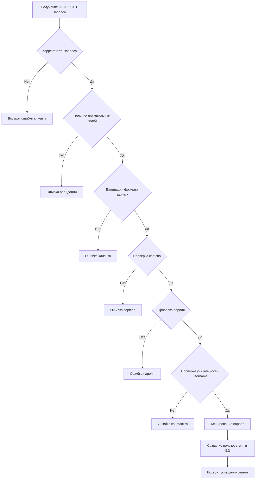

# Тестовое задание  
## Junior Fullstack-аналитик

---

## 📂 Структура проекта

```text
Проект/
├── Задание-3.1/
│   └── user-registration-api.yaml
├── Задание-3.2/
│   └── txt.xml
└── Тестовое задание/
    └── тестовое задание.docx
```

---

## 📝 Задание 3.1  
### REST API регистрации пользователя

**Метод:** `POST`  
**URL:** `/api/v1/users/register`

### Входные параметры (JSON)

```json
{
  "firstName": "Ivan",
  "lastName": "Ivanov",
  "username": "ivan",
  "password": "Qwerty@123",
  "captchaToken": "03AFcWeA"
}
```

### Успешный ответ (HTTP 201)

```json
{
  "userId": "8c1e4b8d-5a2c-4c8e-9c3a-123456789abc",
  "message": "User registered successfully"
}
```

### Ответ с ошибкой (HTTP 4xx / 5xx)

```json
{
  "errorCode": "USER_ALREADY_EXISTS",
  "errorMessage": "User with this username already exists"
}
```

### Коды ошибок

| HTTP-код | Описание |
|---------|----------|
| 400 | Ошибка валидации входных данных |
| 401 | Captcha не подтверждена |
| 409 | Пользователь уже существует |
| 422 | Пароль не соответствует требованиям безопасности |
| 500 | Внутренняя ошибка сервера |

---

## 🛠 Задание 3.2  
### Алгоритм создания пользователя на backend



### Пошаговый алгоритм

1. Проверка наличия обязательных параметров: `firstName`, `lastName`, `username`, `password`, `captchaToken`
2. Валидация формата и ограничений данных
3. Проверка captcha через внешний сервис
4. Проверка пароля на соответствие требованиям безопасности
5. Проверка уникальности `username` в базе данных
6. Хеширование пароля безопасным алгоритмом
7. Создание пользователя в базе данных
8. Присвоение активного статуса
9. Формирование ответа с HTTP 201 и идентификатором пользователя

---

## 📋 Тестовое задание БА / СА

### Задача 1  
**Модель бизнес-процесса (BPMN 2.0)**  
Процесс выдачи ИТ-оборудования пользователю в компании «X».

**Основные этапы:**
- Регистрация запроса пользователем
- Создание заявки в системе снабжения
- Проверка наличия оборудования
- Организация логистики
- Выдача оборудования пользователю
- Закрытие заявки

**Проблемы и противоречия:**
- Отсутствие SLA
- Неопределённость ответственных за закрытие заявок
- Отсутствие сценариев обработки отказов

### Задача 2  
**Формулировка требований к публикации товара на маркетплейсе**

**User Story:**  
Как продавец маркетплейса, я хочу публиковать товары, чтобы покупатели могли их видеть и покупать.

**Use Case:**  
Создание товара, заполнение атрибутов, валидация данных, публикация после модерации.

**Альтернативные сценарии:**
- Ошибки при заполнении данных
- Отсутствие верификации продавца
- Отклонение товара модерацией

---

## 🚀 Использование

Клонировать репозиторий:

```bash
git clone https://github.com/Lorgar40k/Junior-Fullstack-аналитик.git
```

